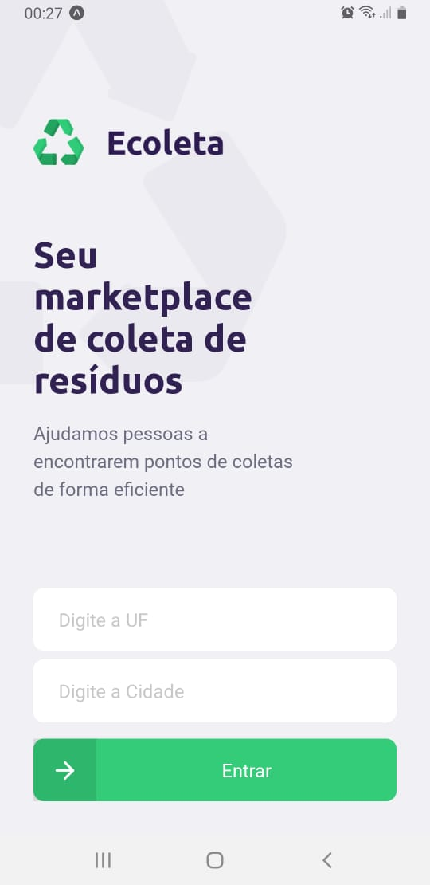
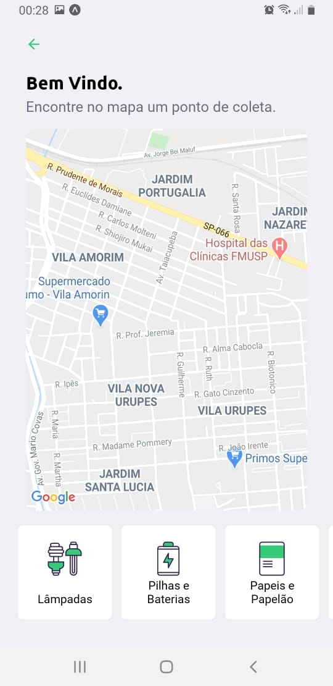

<h1>🚀 Next-Level-Week Rocketseat<h1>
<h3 align="center">
  
    <br> 
    <br>
</h3>
<p align="center">
  <a href="https://rocketseat.com.br">
    
  </a>
  <a>
  
  <br><br>
</p>
<p align="center">
  
   
  
</p>
<h2>Sobre 📜</h2>
Ecoleta é uma aplicação Web e Mobile para ajudar pessoas a encontrarem pontos de coleta de materiais para reciclagem.

Essa aplicação foi construída na trilha Booster da Next Level Week distribuída pela [Rocketseat](https://rocketseat.com.br/).

<h1>Tecnologias Utilizadas 💻</h1>

-[TypeScript](https://www.typescriptlang.org/)
- [Node.js](https://nodejs.org/en/)
- [ReactJS](https://reactjs.org/)
- [React Native](https://reactnative.dev/)

## :fire: Como usar

- ### **Pré-requisitos**

  - É **necessário** possuir o **[Node.js](https://nodejs.org/en/)** instalado na máquina
  - Também, é **preciso** ter um gerenciador de pacotes seja o **[NPM](https://www.npmjs.com/)** ou **[Yarn](https://yarnpkg.com/)**.
  - Por fim, é **essencial** ter o **[Expo](https://expo.io/)** instalado de forma global na máquina

1. Faça um clone :

```sh
  $ git clone https://github.com/vitorserrano/ecoleta.git
```

2. Executando a Aplicação:

```sh
  # Instale as dependências
  $ npm install

  ## Crie o banco de dados
  $ cd server
  $ npm run knex:migrate
  $ npm run knex:seed

  # Inicie a API
  $ npm run dev

  # Inicie a aplicação web
  $ cd web
  $ npm start

  # Inicie a aplicação mobile
  $ cd mobile
  $ npm start
```
  ## :mortar_board: Quem ministrou?

As aulas foram ministradas pelo mestre **[Diego Fernandes](https://github.com/diego3g)** nas aulas da **Next Level Week**.

<h4 align="center">
    Feito por <a href="www.linkedin.com/in/ederson-silva-79b46110b" target="_blank">Ederson Silva</a>
</h4>
